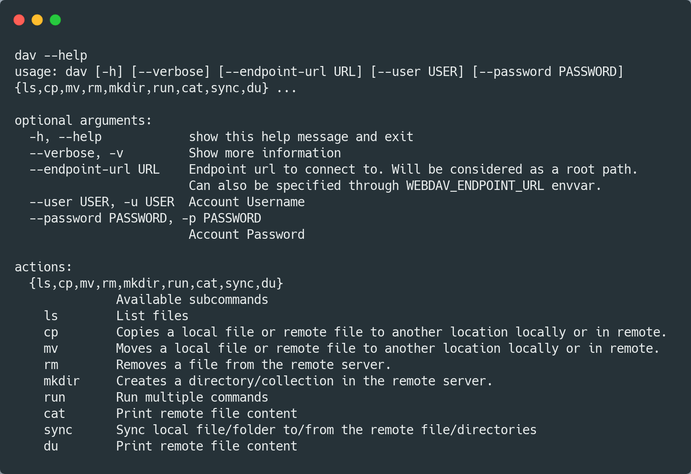

# webdav4

[](https://www.repostatus.org/#wip)

[](https://codecov.io/gh/skshetry/webdav4)

Webdav API with an (optional) [fsspec](#fsspec) implementation and a [CLI](#cli).

## Installation

```console
$ pip install webdav4
```

### Usage

#### webdav4 Client
```python
from webdav4.client import Client

client = Client("https://webdav.com", auth=("username", "password"))
client.exists("Documents/Readme.md")

client.ls("Photos", detail=False)
client.upload_file("Gorilla.jpg", "Photos/Gorilla.jpg")
```

Check out [Client API](docs/reference/client.md) reference for more information.


#### fsspec

[`fsspec`](https://filesystem-spec.readthedocs.io) tries to provide a
consistent APIs to different storage backends, by defining standard
interfaces, so that other code using them could operate without depending
on the implementations of the backends. This package, in the same way,
wraps the above [webdav client](#webdav4-client) with a consistent file-system API.


To use it, you need to install `fsspec` additionally which you can do as
follows:

```console
$ pip install webdav4[fsspec]
```

```python
from webdav4.fsspec import WebdavFileSystem

fs = WebdavFileSystem("https://webdav.com", auth=("username", "password"))
fs.exists("Documents/Readme.md")

fs.ls("Photos", detail=False)
```

Check out [WebdavFileSystem API](docs/reference/fsspec.md) reference for more information.


#### CLI

webdav4 also provides a CLI similar to `aws s3` to make it easier to work with webdav servers.


Please checkout [CLI Usage](docs/reference/cli.md) for more information.

### Contributing

Contributions are welcome. Please take a look at
[Contributing Guide](docs/contributing.md) for more details.
